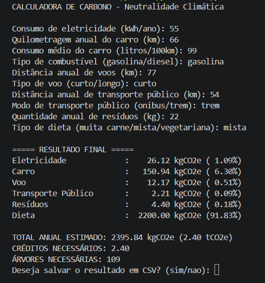

# 🌱 Carbon Footprint Calculator


Uma calculadora de pegada de carbono desenvolvida em Python que estima emissões anuais de CO₂e com base nos hábitos do usuário.

---

## 📌 Sobre o projeto

Este projeto foi desenvolvido como parte de uma Atividade Prática Supervisionada (APS), com foco em sustentabilidade e aplicação de conceitos de programação.

A aplicação calcula o impacto ambiental anual considerando:

- Consumo de energia elétrica  
- Uso de carro  
- Viagens aéreas  
- Transporte público  
- Produção de resíduos  
- Tipo de dieta  

---

## ⚙️ Funcionalidades

- 🔌 Cálculo de emissões por categoria  
- 📊 Total anual em kg e toneladas de CO₂e  
- 🌳 Estimativa de árvores para compensação  
- 💳 Estimativa de créditos de carbono  
- 💾 Exportação dos resultados em CSV  
- 🧪 Testes automatizados com pytest  
- ✅ Validação de entrada do usuário  

---

## 🗂️ Estrutura do projeto

```text
carbon-calculator-python/
├── src/
│   ├── calculator.py
│   ├── factors.py
│   ├── input_handler.py
│   ├── report.py
│   └── storage.py
├── tests/
│   └── test_calculator.py
├── data/
│   └── results.csv
├── docs/
├── assets/
│   └── demo.png
├── main.py
├── requirements.txt
├── README.md
🚀 Como executar
1. Instalar dependências
python -m pip install -r requirements.txt
2. Executar o projeto
python main.py
3. Rodar testes
python -m pytest
💡 Exemplo de uso
Consumo de eletricidade (kWh/ano): 2000
Quilometragem anual do carro (km): 12000
Consumo médio do carro (litros/100km): 8.33
Tipo de combustível: gasolina
Distância anual de voos (km): 0
Tipo de voo: curto
...
🧠 Conceitos aplicados
Programação modular (separação em camadas)
Validação de entrada
Manipulação de arquivos CSV
Testes automatizados
Boas práticas de organização de projeto
Versionamento com Git e GitHub
📈 Melhorias futuras
Interface gráfica (GUI)
Versão web com Streamlit
Dashboard com gráficos
API REST
Integração com banco de dados
👨‍💻 Autor

Desenvolvido por estudante de Ciência da Computação com foco em desenvolvimento de software e análise de dados.


---